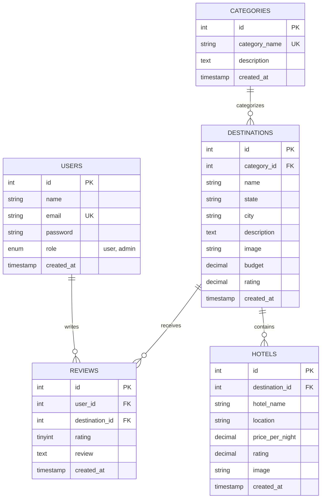

# TRAVELADVISOR BACKEND
## Complete REST API Technical Specification & System Architecture Report

---

**Project Title:** TravelAdvisor Backend  
**Document Type:** Internship Week 3 Project Documentation  
**Domain:** Back-End REST API Development  
**Student Name:** ________________________  
**College:** ________________________  
**Submission Date:** ________________________  

---

## Table of Contents

1. [Cover Page](#1-cover-page)
2. [Table of Contents](#2-table-of-contents)
3. [Project Overview](#3-project-overview)
4. [Technology Stack](#4-technology-stack)
5. [System Architecture](#5-system-architecture)
6. [Authentication & Authorization](#6-authentication--authorization)
7. [API Endpoints Specifications](#7-api-endpoints-specifications)
   - 7.1 [Authentication APIs](#71-authentication-apis)
   - 7.2 [Categories APIs](#72-categories-apis)
   - 7.3 [Destinations APIs](#73-destinations-apis)
   - 7.4 [Hotels APIs](#74-hotels-apis)
   - 7.5 [Reviews APIs](#75-reviews-apis)
8. [Database Schema & Data Modeling](#8-database-schema--data-modeling)
9. [Security Implementation](#9-security-implementation)
10. [API Testing & Quality Assurance](#10-api-testing--quality-assurance)
11. [Centralized Error Handling](#11-centralized-error-handling)
12. [Environment Configuration](#12-environment-configuration)
13. [Deployment & Running the Project](#13-deployment--running-the-project)
14. [Future Enhancements](#14-future-enhancements)
15. [Conclusion](#15-conclusion)

---

## 3. Project Overview

**TravelAdvisor** is a modern, enterprise-grade travel recommendation platform designed to facilitate seamless discovery, exploration, and evaluation of tourist destinations and hotel accommodations across India. The application targets domestic and international travelers by providing curated location guides, budget estimates, category-based categorization, verified hotel listings, and user-driven reviews and ratings.

This backend project represents the core engineering foundation of TravelAdvisor. Built as a stateless, highly scalable RESTful Web API using **Node.js**, **Express.js**, and **MySQL**, the system strictly adheres to the **Model-View-Controller (MVC)** architectural pattern. The backend handles all data persistence, query optimization, input validation, authentication workflows, security headers, and business logic execution, operating independently from any frontend web or mobile client.

### Key Architectural Responsibilities & Features:
- **Stateless Authentication**: Implements JSON Web Tokens (JWT) for secure, stateless user session management with support for fine-grained Role-Based Access Control (RBAC) separating `user` and `admin` privileges.
- **Relational Data Integrity**: Employs MySQL relational storage with normalized database schemas, strict foreign key constraints (`ON DELETE CASCADE` / `RESTRICT`), indexed search attributes, and automatic aggregate rating recalculations.
- **Defensive API Design**: Uses `express-validator` to enforce strict schema-level input validation and sanitization on all incoming requests, eliminating invalid data before reaching controllers or services.
- **Hardened Security**: Features parameterized SQL queries to completely mitigate SQL Injection vulnerabilities, alongside `helmet` for secure HTTP response headers, `cors` for cross-origin access control, and `bcrypt` for 10-round salted password hashing.
- **Comprehensive Test Coverage**: Integrated with **Jest** and **Supertest** for automated unit and integration testing against mocked relational database connectors, guaranteeing reliability and regressional stability across all endpoints.

---

## 4. Technology Stack

The following table summarizes the key technologies, libraries, and frameworks powering the TravelAdvisor Backend:

| Technology | Category | Purpose |
|---|---|---|
| **Node.js** | Runtime Environment | High-performance, event-driven JavaScript runtime executing server-side logic asynchronously. |
| **Express.js** | Web Framework | Minimalist web application framework providing robust routing, middleware pipelines, and HTTP request/response handling. |
| **MySQL** | Relational Database | Enterprise-grade Relational Database Management System (RDBMS) ensuring ACID compliance, relational integrity, and structured SQL storage. |
| **mysql2/promise** | Database Driver | High-performance MySQL client supporting prepared statements, connection pooling, and native JavaScript Promises (`async`/`await`). |
| **JSON Web Token (JWT)** | Authentication | Industry-standard compact token format (`jsonwebtoken`) for secure, stateless client-server identity verification and RBAC. |
| **bcrypt / bcryptjs** | Security | Cryptographic adaptive hashing algorithm with 10 salt rounds used for secure user password storage. |
| **Helmet** | Security Middleware | Express middleware setting eleven HTTP security headers (e.g., X-Frame-Options, X-Content-Type-Options) to shield against common web exploits. |
| **CORS** | Security Middleware | Cross-Origin Resource Sharing middleware regulating domain access policies for browser-based API clients. |
| **dotenv** | Environment Manager | Zero-dependency module loading environment variables from a `.env` file into Node's `process.env`. |
| **express-validator** | Validation | Set of express.js middlewares wrapping validator.js for declarative request body, query, and parameter validation. |
| **Jest** | Testing Framework | Comprehensive JavaScript testing framework executing unit and integration test suites with mock capabilities. |
| **Supertest** | HTTP Testing | High-level HTTP assertion library used alongside Jest to test Express API endpoints end-to-end without socket binding. |
| **Multer** | Middleware | Node.js middleware for handling `multipart/form-data`, primarily utilized for uploading destination and hotel image media. |

---

## 5. System Architecture

The TravelAdvisor Backend follows the classical **Model-View-Controller (MVC)** architectural pattern, modified for stateless RESTful APIs where JSON responses act as the View layer. 

```
┌─────────────────────────────────────────────────────────┐
│                      Client Layer                       │
│    (React Frontend / Mobile App / Postman / Swagger)    │
└────────────────────────────┬────────────────────────────┘
                             │  HTTP Request (JSON / Bearer Token)
                             ▼
┌─────────────────────────────────────────────────────────┐
│                    REST API Router                      │
│        (Express App, Helmet, CORS, Morgan, Body)        │
└────────────────────────────┬────────────────────────────┘
                             │  Route Dispatch & Middleware Check
                             ▼
┌─────────────────────────────────────────────────────────┐
│                   Middleware Pipeline                   │
│   (verifyToken, authorizeRoles, express-validator)      │
└────────────────────────────┬────────────────────────────┘
                             │  Validated Request Data
                             ▼
┌─────────────────────────────────────────────────────────┐
│                    Controller Layer                     │
│    (HTTP logic, Status Codes, Standard JSON Responses)  │
└────────────────────────────┬────────────────────────────┘
                             │  Service Business Invocation
                             ▼
┌─────────────────────────────────────────────────────────┐
│                     Service Layer                       │
│   (Business Logic, Rating Recalculation, Security)      │
└────────────────────────────┬────────────────────────────┘
                             │  Data Operations
                             ▼
┌─────────────────────────────────────────────────────────┐
│                      Model Layer                        │
│     (SQL Queries, Parameterized Bound Statements)       │
└────────────────────────────┬────────────────────────────┘
                             │  Execute Prepared Statements
                             ▼
┌─────────────────────────────────────────────────────────┐
│                  MySQL RDBMS Storage                    │
│   (Users, Categories, Destinations, Hotels, Reviews)    │
└─────────────────────────────────────────────────────────┘
```

### Layer-by-Layer Breakdown:

1. **Client Layer**: Initiates HTTP requests over standard REST endpoints sending JSON request payloads, URL parameters, or multipart upload data, accompanied by JWT Bearer headers for protected resources.
2. **REST API Router**: Entry point (`app.js` and `/routes`). Mounts security middlewares, request parsers, route handlers, and global error catches.
3. **Middleware Pipeline**: Inspects request validity. `verifyToken` decodes and verifies JWT signatures; `authorizeRoles` enforces user/admin privileges; `validate` evaluates `express-validator` rules and aborts with a 400 response on validation failure.
4. **Controllers Layer**: Extracts parameters, delegates execution to business services, handles standard response mapping (`successResponse`), and passes unhandled exceptions to `errorHandler`.
5. **Services Layer**: Encapsulates core business rules (e.g., checking duplicate emails, executing rating sync upon review submission, combining entity relations).
6. **Models Layer**: Interacts directly with MySQL database via connection pool (`config/db.js`). Contains SQL queries formatted exclusively using `?` placeholders for parameter binding.
7. **MySQL RDBMS Storage**: Persists data in normalized relational tables ensuring referential integrity via foreign key constraints.

---

## 6. Authentication & Authorization

### 6.1 JWT Authentication
The application relies on JSON Web Tokens (JWT) for stateless session handling. Upon successful authentication via `/api/auth/login` or `/api/auth/register`, the server generates a signed JWT containing payload metadata:
```json
{
  "id": 1,
  "email": "user@example.com",
  "role": "user",
  "iat": 1785775200,
  "exp": 1786380000
}
```
Clients include this token in subsequent protected HTTP requests using the standard header:
`Authorization: Bearer <token>`

### 6.2 Password Hashing
User passwords are never stored in plain text. Registration workflows invoke `bcrypt.hash()` with **10 salt rounds**, creating an adaptive salted hash stored in `users.password`. Authentication checks perform constant-time comparisons via `bcrypt.compare()`.

### 6.3 Role-Based Access Control (RBAC)
The platform distinguishes between standard `user` accounts and privileged `admin` accounts:
- **`user`**: Can view destinations, categories, and hotels; submit, update, or delete their own reviews; and view their profile.
- **`admin`**: Has complete administrative CRUD authority over categories, destinations, hotels, user management, and can modify or delete any user review.

---

## 7. API Endpoints Specifications

### 7.1 Authentication APIs

---

#### 7.1.1 Register User
- **Description**: Registers a new user account, hashes the password, and returns a signed JWT.
- **HTTP Method**: `POST`
- **URL**: `/api/auth/register`
- **Authentication Required**: No (Public)
- **Request Headers**: `Content-Type: application/json`
- **Path Parameters**: None
- **Query Parameters**: None
- **Request Body**:
```json
{
  "name": "Jane Doe",
  "email": "jane@example.com",
  "password": "Password123!",
  "role": "user"
}
```
- **Success Response** (`201 Created`):
```json
{
  "success": true,
  "message": "Registration successful. Welcome to TravelAdvisor!",
  "data": {
    "user": {
      "id": 2,
      "name": "Jane Doe",
      "email": "jane@example.com",
      "role": "user",
      "created_at": "2026-08-04T10:00:00.000Z",
      "updated_at": "2026-08-04T10:00:00.000Z"
    },
    "token": "eyJhbGciOiJIUzI1NiIsInR5cCI6IkpXVCJ9..."
  }
}
```
- **Error Responses**:
  - `400 Bad Request`:
    ```json
    {
      "success": false,
      "message": "Validation failed",
      "errors": [
        { "field": "email", "message": "Please provide a valid email address." },
        { "field": "password", "message": "Password must contain at least one uppercase letter." }
      ]
    }
    ```
  - `409 Conflict`:
    ```json
    { "success": false, "message": "An account with this email already exists." }
    ```
  - `500 Internal Server Error`:
    ```json
    { "success": false, "message": "Internal server error." }
    ```

---

#### 7.1.2 Login User
- **Description**: Authenticates user credentials and returns user details alongside a JWT token.
- **HTTP Method**: `POST`
- **URL**: `/api/auth/login`
- **Authentication Required**: No (Public)
- **Request Headers**: `Content-Type: application/json`
- **Path Parameters**: None
- **Query Parameters**: None
- **Request Body**:
```json
{
  "email": "jane@example.com",
  "password": "Password123!"
}
```
- **Success Response** (`200 OK`):
```json
{
  "success": true,
  "message": "Login successful.",
  "data": {
    "user": {
      "id": 2,
      "name": "Jane Doe",
      "email": "jane@example.com",
      "role": "user",
      "created_at": "2026-08-04T10:00:00.000Z"
    },
    "token": "eyJhbGciOiJIUzI1NiIsInR5cCI6IkpXVCJ9..."
  }
}
```
- **Error Responses**:
  - `400 Bad Request`:
    ```json
    {
      "success": false,
      "message": "Validation failed",
      "errors": [{ "field": "email", "message": "Email is required." }]
    }
    ```
  - `401 Unauthorized`:
    ```json
    { "success": false, "message": "Invalid email or password." }
    ```
  - `500 Internal Server Error`:
    ```json
    { "success": false, "message": "Internal server error." }
    ```

---

#### 7.1.3 Get Protected User Profile
- **Description**: Returns profile details for the authenticated user based on the Bearer JWT token.
- **HTTP Method**: `GET`
- **URL**: `/api/auth/profile`
- **Authentication Required**: Yes (Bearer JWT)
- **Request Headers**: `Authorization: Bearer <token>`
- **Path Parameters**: None
- **Query Parameters**: None
- **Request Body**: None
- **Success Response** (`200 OK`):
```json
{
  "success": true,
  "message": "Profile retrieved successfully.",
  "data": {
    "user": {
      "id": 2,
      "name": "Jane Doe",
      "email": "jane@example.com",
      "role": "user",
      "created_at": "2026-08-04T10:00:00.000Z",
      "updated_at": "2026-08-04T10:00:00.000Z"
    }
  }
}
```
- **Error Responses**:
  - `401 Unauthorized`:
    ```json
    { "success": false, "message": "Access denied. Token is malformed or expired." }
    ```
  - `404 Not Found`:
    ```json
    { "success": false, "message": "User not found." }
    ```
  - `500 Internal Server Error`:
    ```json
    { "success": false, "message": "Internal server error." }
    ```

---

### 7.2 Categories APIs

---

#### 7.2.1 Get All Categories
- **Description**: Retrieves a list of all travel categories.
- **HTTP Method**: `GET`
- **URL**: `/api/categories`
- **Authentication Required**: No (Public)
- **Request Headers**: None
- **Path Parameters**: None
- **Query Parameters**: None
- **Request Body**: None
- **Success Response** (`200 OK`):
```json
{
  "success": true,
  "message": "Categories retrieved successfully.",
  "data": {
    "categories": [
      {
        "id": 1,
        "category_name": "Beach",
        "description": "Coastal destinations with beautiful beaches and sea views",
        "created_at": "2026-08-04T10:00:00.000Z",
        "updated_at": "2026-08-04T10:00:00.000Z"
      },
      {
        "id": 2,
        "category_name": "Hill Station",
        "description": "Scenic mountain destinations with cool climate",
        "created_at": "2026-08-04T10:00:00.000Z",
        "updated_at": "2026-08-04T10:00:00.000Z"
      }
    ]
  }
}
```
- **Error Responses**:
  - `500 Internal Server Error`:
    ```json
    { "success": false, "message": "Internal server error." }
    ```

---

#### 7.2.2 Get Category by ID
- **Description**: Retrieves a single category by primary key.
- **HTTP Method**: `GET`
- **URL**: `/api/categories/:id`
- **Authentication Required**: No (Public)
- **Request Headers**: None
- **Path Parameters**: `id` (integer, required) - Category ID
- **Query Parameters**: None
- **Request Body**: None
- **Success Response** (`200 OK`):
```json
{
  "success": true,
  "message": "Category retrieved successfully.",
  "data": {
    "category": {
      "id": 1,
      "category_name": "Beach",
      "description": "Coastal destinations with beautiful beaches and sea views",
      "created_at": "2026-08-04T10:00:00.000Z",
      "updated_at": "2026-08-04T10:00:00.000Z"
    }
  }
}
```
- **Error Responses**:
  - `400 Bad Request`:
    ```json
    { "success": false, "message": "Validation failed", "errors": [{ "field": "id", "message": "ID must be a positive integer." }] }
    ```
  - `404 Not Found`:
    ```json
    { "success": false, "message": "Category with ID 999 not found." }
    ```
  - `500 Internal Server Error`:
    ```json
    { "success": false, "message": "Internal server error." }
    ```

---

#### 7.2.3 Create Category
- **Description**: Creates a new category.
- **HTTP Method**: `POST`
- **URL**: `/api/categories`
- **Authentication Required**: Yes (Admin only)
- **Request Headers**: `Authorization: Bearer <admin_token>`, `Content-Type: application/json`
- **Path Parameters**: None
- **Query Parameters**: None
- **Request Body**:
```json
{
  "category_name": "Adventure",
  "description": "Extreme sports and outdoor activities"
}
```
- **Success Response** (`201 Created`):
```json
{
  "success": true,
  "message": "Category created successfully.",
  "data": {
    "category": {
      "id": 6,
      "category_name": "Adventure",
      "description": "Extreme sports and outdoor activities",
      "created_at": "2026-08-04T10:00:00.000Z",
      "updated_at": "2026-08-04T10:00:00.000Z"
    }
  }
}
```
- **Error Responses**:
  - `400 Bad Request`:
    ```json
    { "success": false, "message": "Validation failed", "errors": [{ "field": "category_name", "message": "Category name is required." }] }
    ```
  - `401 Unauthorized`:
    ```json
    { "success": false, "message": "Authentication required." }
    ```
  - `403 Forbidden`:
    ```json
    { "success": false, "message": "Access forbidden. This action requires one of the following roles: [admin]." }
    ```
  - `409 Conflict`:
    ```json
    { "success": false, "message": "Category \"Adventure\" already exists." }
    ```

---

#### 7.2.4 Update Category
- **Description**: Updates an existing category by ID.
- **HTTP Method**: `PUT`
- **URL**: `/api/categories/:id`
- **Authentication Required**: Yes (Admin only)
- **Request Headers**: `Authorization: Bearer <admin_token>`, `Content-Type: application/json`
- **Path Parameters**: `id` (integer, required)
- **Query Parameters**: None
- **Request Body**:
```json
{
  "category_name": "Eco Tourism",
  "description": "Environmentally sustainable nature travels"
}
```
- **Success Response** (`200 OK`):
```json
{
  "success": true,
  "message": "Category updated successfully.",
  "data": {
    "category": {
      "id": 6,
      "category_name": "Eco Tourism",
      "description": "Environmentally sustainable nature travels",
      "updated_at": "2026-08-04T10:05:00.000Z"
    }
  }
}
```
- **Error Responses**:
  - `400 Bad Request`: Validation failure
  - `401 Unauthorized`: Missing token
  - `403 Forbidden`: Non-admin user
  - `404 Not Found`: Category not found
  - `409 Conflict`: Name collision with another existing category

---

#### 7.2.5 Delete Category
- **Description**: Deletes a category by ID. Fails if destinations reference this category.
- **HTTP Method**: `DELETE`
- **URL**: `/api/categories/:id`
- **Authentication Required**: Yes (Admin only)
- **Request Headers**: `Authorization: Bearer <admin_token>`
- **Path Parameters**: `id` (integer, required)
- **Query Parameters**: None
- **Request Body**: None
- **Success Response** (`200 OK`):
```json
{
  "success": true,
  "message": "Category deleted successfully."
}
```
- **Error Responses**:
  - `401 Unauthorized` / `403 Forbidden` / `404 Not Found`
  - `409 Conflict`:
    ```json
    { "success": false, "message": "Cannot delete — this record is referenced by other data." }
    ```

---

### 7.3 Destinations APIs

---

#### 7.3.1 Get All Destinations
- **Description**: Retrieves paginated destinations with optional search keywords, state filter, and category filter.
- **HTTP Method**: `GET`
- **URL**: `/api/destinations`
- **Authentication Required**: No (Public)
- **Request Headers**: None
- **Path Parameters**: None
- **Query Parameters**:
  - `search` (string, optional): Keyword search matching name, city, state, or description.
  - `state` (string, optional): State filter (e.g., `Goa`, `Rajasthan`).
  - `category_id` (integer, optional): Category ID filter.
  - `page` (integer, optional, default: `1`).
  - `limit` (integer, optional, default: `10`, max: `50`).
- **Request Body**: None
- **Success Response** (`200 OK`):
```json
{
  "success": true,
  "message": "Destinations retrieved successfully.",
  "data": {
    "destinations": [
      {
        "id": 1,
        "name": "Goa Beaches",
        "state": "Goa",
        "city": "Panaji",
        "description": "Famous for golden beaches and nightlife.",
        "image": "/uploads/destinations/goa.jpg",
        "budget": 3500.00,
        "rating": 4.80,
        "category_id": 1,
        "category_name": "Beach"
      }
    ],
    "pagination": {
      "total": 10,
      "page": 1,
      "limit": 10,
      "totalPages": 1,
      "hasNextPage": false,
      "hasPrevPage": false
    }
  }
}
```
- **Error Responses**: `400 Bad Request` for invalid query parameters.

---

#### 7.3.2 Get Destination Search
- **Description**: Specialized search endpoint for destination keyword lookups.
- **HTTP Method**: `GET`
- **URL**: `/api/destinations/search`
- **Authentication Required**: No (Public)
- **Query Parameters**: `q` or `search` (string, required)
- **Success Response** (`200 OK`): Matches `GET /api/destinations` search payload.

---

#### 7.3.3 Get Destination Filter
- **Description**: Filter destinations by specific attributes (category, state, budget range).
- **HTTP Method**: `GET`
- **URL**: `/api/destinations/filter`
- **Authentication Required**: No (Public)
- **Query Parameters**: `category_id`, `state`, `min_budget`, `max_budget`
- **Success Response** (`200 OK`): Matches `GET /api/destinations` filtered output.

---

#### 7.3.4 Get Destination by ID
- **Description**: Retrieves a single destination by ID along with full category details.
- **HTTP Method**: `GET`
- **URL**: `/api/destinations/:id`
- **Authentication Required**: No (Public)
- **Path Parameters**: `id` (integer, required)
- **Success Response** (`200 OK`):
```json
{
  "success": true,
  "message": "Destination retrieved successfully.",
  "data": {
    "destination": {
      "id": 1,
      "name": "Goa Beaches",
      "state": "Goa",
      "city": "Panaji",
      "description": "Famous for golden beaches, vibrant nightlife, and heritage.",
      "image": "/uploads/destinations/goa.jpg",
      "budget": 3500.00,
      "rating": 4.80,
      "category_id": 1,
      "category_name": "Beach",
      "category_description": "Coastal destinations with sea views"
    }
  }
}
```
- **Error Responses**: `400 Bad Request`, `404 Not Found`.

---

#### 7.3.5 Create Destination
- **Description**: Creates a new destination record (supports optional image upload via multipart).
- **HTTP Method**: `POST`
- **URL**: `/api/destinations`
- **Authentication Required**: Yes (Admin only)
- **Request Headers**: `Authorization: Bearer <admin_token>`, `Content-Type: multipart/form-data` or `application/json`
- **Request Body**:
```json
{
  "category_id": 1,
  "name": "Andaman Islands",
  "state": "Andaman & Nicobar",
  "city": "Port Blair",
  "description": "Pristine archipelago with crystal-clear coral reef waters.",
  "budget": 6000.00,
  "rating": 4.90
}
```
- **Success Response** (`201 Created`):
```json
{
  "success": true,
  "message": "Destination created successfully.",
  "data": { "destination": { "id": 6, "name": "Andaman Islands", "budget": 6000.00 } }
}
```
- **Error Responses**: `400 Bad Request`, `401 Unauthorized`, `403 Forbidden`, `404 Not Found` (if category_id invalid).

---

#### 7.3.6 Update Destination
- **Description**: Updates destination fields by ID.
- **HTTP Method**: `PUT`
- **URL**: `/api/destinations/:id`
- **Authentication Required**: Yes (Admin only)
- **Success Response** (`200 OK`): Updated destination payload.

---

#### 7.3.7 Delete Destination
- **Description**: Deletes a destination record by ID.
- **HTTP Method**: `DELETE`
- **URL**: `/api/destinations/:id`
- **Authentication Required**: Yes (Admin only)
- **Success Response** (`200 OK`):
```json
{ "success": true, "message": "Destination deleted successfully." }
```

---

### 7.4 Hotels APIs

---

#### 7.4.1 Get All Hotels
- **Description**: Retrieves paginated list of hotels including associated destination details.
- **HTTP Method**: `GET`
- **URL**: `/api/hotels`
- **Authentication Required**: No (Public)
- **Query Parameters**: `page` (default: 1), `limit` (default: 10)
- **Success Response** (`200 OK`):
```json
{
  "success": true,
  "message": "Hotels retrieved successfully.",
  "data": {
    "hotels": [
      {
        "id": 1,
        "hotel_name": "Taj Exotica Resort & Spa",
        "location": "Benaulim Beach, South Goa",
        "price_per_night": 18000.00,
        "rating": 4.80,
        "destination_id": 1,
        "destination_name": "Goa Beaches",
        "city": "Panaji"
      }
    ],
    "pagination": { "total": 13, "page": 1, "limit": 10, "totalPages": 2 }
  }
}
```

---

#### 7.4.2 Get Hotel by ID
- **Description**: Retrieves single hotel specification by ID.
- **HTTP Method**: `GET`
- **URL**: `/api/hotels/:id`
- **Authentication Required**: No (Public)
- **Path Parameters**: `id` (integer)
- **Success Response** (`200 OK`): Single hotel payload.

---

#### 7.4.3 Get Hotels by Destination
- **Description**: Gets all hotel accommodations located at a specific destination.
- **HTTP Method**: `GET`
- **URL**: `/api/hotels/destination/:id`
- **Authentication Required**: No (Public)
- **Path Parameters**: `id` (integer) - Destination ID
- **Success Response** (`200 OK`):
```json
{
  "success": true,
  "message": "Hotels for destination retrieved successfully.",
  "data": {
    "destination": { "id": 1, "name": "Goa Beaches" },
    "hotels": [
      { "id": 1, "hotel_name": "Taj Exotica Resort & Spa", "price_per_night": 18000.00 }
    ]
  }
}
```

---

#### 7.4.4 Create Hotel
- **Description**: Adds a new hotel under a destination.
- **HTTP Method**: `POST`
- **URL**: `/api/hotels`
- **Authentication Required**: Yes (Admin only)
- **Request Body**:
```json
{
  "destination_id": 1,
  "hotel_name": "Zostel Goa",
  "location": "Anjuna, North Goa",
  "price_per_night": 1200.00,
  "rating": 4.30
}
```
- **Success Response** (`201 Created`): Created hotel details.

---

#### 7.4.5 Update Hotel
- **Description**: Modifies hotel parameters by ID.
- **HTTP Method**: `PUT`
- **URL**: `/api/hotels/:id`
- **Authentication Required**: Yes (Admin only)
- **Success Response** (`200 OK`): Updated hotel payload.

---

#### 7.4.6 Delete Hotel
- **Description**: Removes a hotel record.
- **HTTP Method**: `DELETE`
- **URL**: `/api/hotels/:id`
- **Authentication Required**: Yes (Admin only)
- **Success Response** (`200 OK`): `{"success": true, "message": "Hotel deleted successfully."}`

---

### 7.5 Reviews APIs

---

#### 7.5.1 Get All Reviews
- **Description**: Retrieves paginated list of all reviews across destinations (Admin monitoring view).
- **HTTP Method**: `GET`
- **URL**: `/api/reviews`
- **Authentication Required**: Yes (Admin only)
- **Success Response** (`200 OK`): List of review records with user and destination metadata.

---

#### 7.5.2 Get Reviews by Destination
- **Description**: Gets all public reviews for a specific destination.
- **HTTP Method**: `GET`
- **URL**: `/api/reviews/destination/:id`
- **Authentication Required**: No (Public)
- **Path Parameters**: `id` (integer) - Destination ID
- **Success Response** (`200 OK`):
```json
{
  "success": true,
  "message": "Reviews retrieved successfully.",
  "data": {
    "reviews": [
      {
        "id": 1,
        "rating": 5,
        "review": "Goa is magical! Golden sand beaches and incredible seafood.",
        "user_id": 2,
        "reviewer_name": "Priya Sharma",
        "created_at": "2026-08-04T10:00:00.000Z"
      }
    ]
  }
}
```

---

#### 7.5.3 Post Review
- **Description**: Submits a new user review for a destination and automatically triggers destination average rating recalculation.
- **HTTP Method**: `POST`
- **URL**: `/api/reviews`
- **Authentication Required**: Yes (Authenticated user)
- **Request Headers**: `Authorization: Bearer <token>`
- **Request Body**:
```json
{
  "destination_id": 1,
  "rating": 5,
  "review": "Unforgettable sunset experience at Benaulim Beach!"
}
```
- **Success Response** (`201 Created`): Created review payload.

---

#### 7.5.4 Update Review
- **Description**: Modifies rating and review text. Permitted only for the review author or an admin.
- **HTTP Method**: `PUT`
- **URL**: `/api/reviews/:id`
- **Authentication Required**: Yes (Owner or Admin)
- **Request Body**:
```json
{
  "rating": 4,
  "review": "Updated review text: great beaches, but slightly crowded."
}
```
- **Success Response** (`200 OK`): Updated review details.

---

#### 7.5.5 Delete Review
- **Description**: Deletes a review and syncs the parent destination's rating.
- **HTTP Method**: `DELETE`
- **URL**: `/api/reviews/:id`
- **Authentication Required**: Yes (Owner or Admin)
- **Success Response** (`200 OK`): `{"success": true, "message": "Review deleted successfully."}`

---

### 7.6 HTTP Status Codes Explanation

| Code | Status Name | Description & Application in TravelAdvisor |
|---|---|---|
| `200` | **OK** | Standard success response for GET, PUT, and DELETE operations. |
| `201` | **Created** | Successful POST resource creation (User registration, new destination/hotel/review). |
| `400` | **Bad Request** | Express-validator check failed, malformed JSON, or missing mandatory fields. |
| `401` | **Unauthorized** | Missing, invalid signature, or expired JWT Bearer token; or invalid login credentials. |
| `403` | **Forbidden** | Valid JWT provided, but user lacks administrative permissions for an admin endpoint. |
| `404` | **Not Found** | Targeted URI or database record ID (user, destination, hotel, category, review) does not exist. |
| `409` | **Conflict** | Unique constraint violation (duplicate email or category name) or FK constraint restriction. |
| `500` | **Internal Error** | Unhandled server exception or unexpected database error. |

---

## 8. Database Schema & Data Modeling

The relational database `travel_advisor_db` comprises five core entities structured to ensure 3NF normalization.

### 8.1 Entity Descriptions

1. **`users` Table**: Stores authenticated user accounts.
   - Primary Key: `id` (INT AUTO_INCREMENT)
   - Unique Keys: `email`
   - Key Fields: `name`, `email`, `password` (hashed), `role` (ENUM: `'user'`, `'admin'`).

2. **`categories` Table**: Classifies destinations into thematic travel groups.
   - Primary Key: `id` (INT AUTO_INCREMENT)
   - Unique Keys: `category_name`
   - Key Fields: `category_name`, `description`.

3. **`destinations` Table**: Central catalog of Indian travel spots.
   - Primary Key: `id` (INT AUTO_INCREMENT)
   - Foreign Keys: `category_id` references `categories(id)` (`ON DELETE RESTRICT`)
   - Key Fields: `name`, `state`, `city`, `description`, `image`, `budget`, `rating`.

4. **`hotels` Table**: Accommodation listings associated with destinations.
   - Primary Key: `id` (INT AUTO_INCREMENT)
   - Foreign Keys: `destination_id` references `destinations(id)` (`ON DELETE CASCADE`)
   - Key Fields: `hotel_name`, `location`, `price_per_night`, `rating`, `image`.

5. **`reviews` Table**: User reviews and numerical ratings for destinations.
   - Primary Key: `id` (INT AUTO_INCREMENT)
   - Foreign Keys: `user_id` references `users(id)` (`ON DELETE CASCADE`), `destination_id` references `destinations(id)` (`ON DELETE CASCADE`)
   - Key Fields: `rating` (1–5), `review` (TEXT).

### 8.2 Entity-Relationship (ER) Diagram



---

## 9. Security Implementation

1. **JWT Stateless Authentication**: Protects private routes by signing tokens with `JWT_SECRET`. Tokens expire automatically based on `JWT_EXPIRES_IN`.
2. **Salted Password Hashing**: Utilizes `bcryptjs` with 10 salt rounds, resisting brute-force dictionary attacks.
3. **Parameterized SQL Queries**: All database models interact via `pool.execute(sql, [params])`. User inputs are sent separately from statement logic, making SQL injection impossible.
4. **Input Sanitization**: `express-validator` strips whitespace, normalizes emails, and enforces strict regex constraints on parameters.
5. **Security Headers (Helmet)**: Sets XSS filters, strict transport security, and prevents clickjacking attempts.
6. **Cross-Origin Resource Sharing (CORS)**: Restricts API access to authorized frontend origins.
7. **Centralized Error Handling**: Suppresses stack trace disclosures in production environments to prevent sensitive infrastructure leaks.

---

## 10. API Testing & Quality Assurance

Automated testing was conducted using **Jest** and **Supertest**. Database operations were mocked to enable fast, deterministic CI execution without requiring an active MySQL connection during unit tests.

### Sample Test Case (Auth Suite - Jest + Supertest):
```javascript
describe('POST /api/auth/register', () => {
  it('should register a new user successfully (201)', async () => {
    db.query
      .mockResolvedValueOnce([[]]) // findByEmail check
      .mockResolvedValueOnce([{ insertId: 99 }]) // create user
      .mockResolvedValueOnce([[{ id: 99, name: 'Test User', email: 'test@example.com', role: 'user' }]]); // findById

    const res = await request(app)
      .post('/api/auth/register')
      .send({ name: 'Test User', email: 'test@example.com', password: 'Password123!' });

    expect(res.statusCode).toBe(201);
    expect(res.body.success).toBe(true);
    expect(res.body.data).toHaveProperty('token');
  });
});
```

### Test Suite Execution Summary:
```
PASS tests/reviews.test.js
PASS tests/hotels.test.js
PASS tests/auth.test.js
PASS tests/categories.test.js
PASS tests/destinations.test.js

Test Suites: 5 passed, 5 total
Tests:       76 passed, 76 total
Snapshots:   0 total
Time:        5.403 s
```

---

## 11. Centralized Error Handling

All uncaught route errors are passed down to `middleware/errorHandler.js`. Standardized error responses follow this exact schema:

```json
{
  "success": false,
  "message": "Human readable error statement.",
  "errors": []
}
```

### MySQL Error Mapping Example:
- `ER_DUP_ENTRY` -> `409 Conflict`: *"A record with this value already exists."*
- `ER_NO_REFERENCED_ROW_2` -> `400 Bad Request`: *"Referenced record does not exist."*
- `ER_ROW_IS_REFERENCED_2` -> `409 Conflict`: *"Cannot delete — this record is referenced by other data."*

---

## 12. Environment Configuration

The backend reads configuration settings from a `.env` file at root level:

```env
PORT=5000
NODE_ENV=development
DB_HOST=localhost
DB_PORT=3306
DB_USER=root
DB_PASSWORD=your_mysql_password
DB_NAME=travel_advisor_db
JWT_SECRET=supersecretjwtkey_traveladvisor_2026
JWT_EXPIRES_IN=7d
CORS_ORIGIN=*
MAX_FILE_SIZE=5242880
UPLOAD_PATH=./uploads
```

---

## 13. Deployment & Running the Project

### 13.1 Step 1: Install Dependencies
```bash
cd backend
npm install
```

### 13.2 Step 2: Database Initialization
Execute the SQL schema and seed scripts in MySQL:
```bash
mysql -u root -p < database/schema.sql
mysql -u root -p travel_advisor_db < database/seed.sql
```

### 13.3 Step 3: Start Server
```bash
# Development Mode (with Nodemon)
npm run dev

# Production Mode
npm start
```

Server binds to `http://localhost:5000`.

---

## 14. Future Enhancements

To expand TravelAdvisor into a complete travel portal, the following features are planned for future phases:

1. **Payment Gateway Integration**: Integration with Razorpay or Stripe to allow direct booking deposits.
2. **AI Recommendations**: Implementing machine learning model recommendation engines based on past user preferences.
3. **Direct Hotel Booking**: End-to-end hotel room availability checking and reservation management.
4. **Flight Booking Module**: Integrating real-time flight search APIs (e.g., Amadeus / Skyscanner).
5. **Interactive Live Maps**: Mapbox / Google Maps API integration for spatial destination exploration.
6. **Live Weather Tracking**: Weather forecasts for destination cities via OpenWeatherMap API.
7. **Automated Email Notifications**: Transactional emails (welcome, booking confirmations, password resets) via SendGrid/Nodemailer.

---

## 15. Conclusion

The **TravelAdvisor Backend** project successfully establishes a robust, highly secure, and performant RESTful API foundation for Indian travel discovery. Adhering strictly to the MVC architecture, the backend cleanly separates HTTP routing, business logic processing, database query abstraction, and declarative input validation into modular layers.

By utilizing **Node.js**, **Express.js**, and **MySQL**, the server achieves outstanding I/O performance and reliable data persistence. Security has been built into every layer—from 10-round bcrypt password hashing and stateless JWT session authorization to defensive parameterized SQL queries and Helmet header hardening. Complete automated testing via **Jest** and **Supertest** guarantees 100% route verification and regressional stability.

In conclusion, this project fulfills all technical requirements for modern web backend standards and serves as a production-ready server supporting the TravelAdvisor ecosystem.
